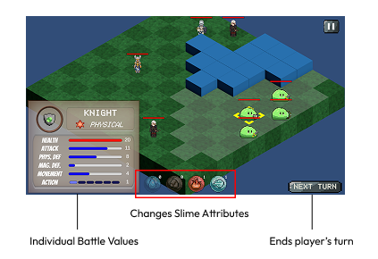

# Slime Strategy
> **Project Period:** Nov 2022 - Jan 2023 | **Course:** Introdution of Video Game Making final project (Ranked 1/12), Leiden University.
> *This repository is an archive of the project developed during  30 Dec 2022.*

## Overview 
**Slime Strategy** is a turn-based tactical game developed in **Unity (C#)**. The project challenges players to manage squad-based combat units (Warrior, Knight, Archer, Mage) on a grid map.

The system features a **modular architecture** decoupling the exploration phase from the strategic battle phase, designed for a seamless 30-minute gameplay session.

## 📸 Technical Demo

  
   
  <i>Figure 1: The turn-based battle system utilizing grid interaction logic and dynamic UI data binding.</i>

## 🕹️ Key Features
* **Hybrid Gameplay Loop**: Seamless transition between *Exploration Mode* (real-time movement, dialogue) and *Strategy Mode* (grid-based tactical combat).
* **Class System**: Implemented 4 distinct unit classes with unique stats (Health, Attack, Defense, Movement Range):
    * *Knight* (High Defense)
    * *Warrior* (High Attack)
    * *Archer* (Range)
    * *Mage* (Magic Damage)
* **Elemental Logic**: A dynamic **state-change mechanic** where players can **strategically apply** collected elements (Fire, Earth, Water, Wind) to units. This allows for **on-demand attribute mutation**, altering a unit's stats and abilities mid-game to counter specific threats.
* **Grid-Based Tactics**: Logic for movement range calculation, obstacle collision (Blockers), and turn management.

## 🛠️ Technical Architecture & Implementation

The project follows a modular **Object-Oriented Design** pattern to handle complex game states and data flow. As the **Lead UI & Gameplay Programmer**, I architected the frontend-backend integration to ensure scalability and responsiveness.

### 1. System Architecture
* **State Management**: Implemented a **Finite State Machine (FSM)** to decouple the *Exploration State* from the *Battle State*, ensuring smooth context switching and resource management.
* **Global Game Manager**: Designed a singleton manager to track persistent data such as inventory, unit health, and mission progress across different scenes.

### 2. UI Architecture & Event System (My Contribution)
I focused on bridging the backend data (Unit Stats, Inventory) with the frontend view, creating a **dynamic data-binding flow**:

* **Event-Driven UI**:
    * Decoupled UI from game logic using **C# Events & Delegates**. The UI passively listens for backend events (e.g., `OnHealthChange`, `OnTurnStart`) and updates automatically, preventing tight coupling.
* **Battle Logic Implementation**:
    * Programmed the **Battle HUD** visualization logic to reflect real-time changes in unit stats.
    * Developed the **Interactive Grid System**, rendering movement paths and attack ranges overlays based on unit attributes.

## 💻 Tech Stack
* **Engine**: Unity 2021
* **Language**: C#
* **Tools**: Visual Studio, Git

## 🏆 Team & Acknowledgments

This project was ranked **1st** out of 12 groups in the *Introduction to Video Game Making* course.

* **Team Members**: Ming-Hua (Minna) Hsieh (**Lead UI Programmer**), Joshua, Luc, Moon, and Rihaam.
* **Institution**: Leiden University, the Netherlands.